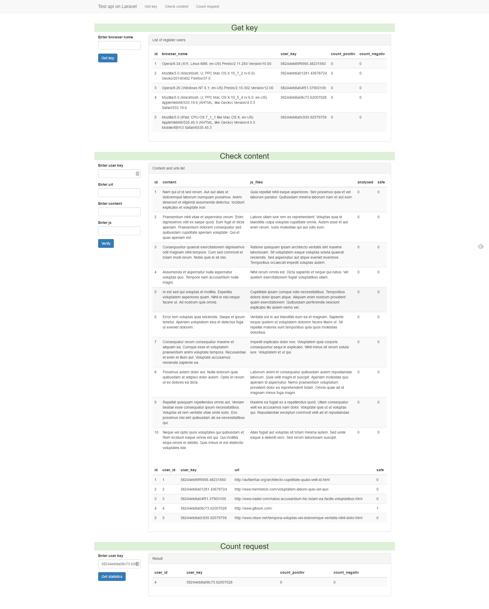

# Test Api with Laravel PHP Framework

## Project description

We are developing a plug-in for your browser which allows checking a website for malicious scripts. This plug-in is embedded in the web page processing progress and sends to backend site metric (currently only URL) and its source code(with all js). When the plugin gets a server response it shows the results  of analysis to the user and it makes a decision whether to visit the site. You need to create a backend for this plugin.
 
## Here is the system workflow:
 
The user installs the plugin. The plugin sends a request to the server for a unique key passing client metrics (for now only browser name). This key is passed to the server with all further requests. If the server receives a request without this key it will return an error.
When a user visits a web page, plug-in sends to the server page URL its content and all js. The server analyses the content and notifies plugin whether it is possible to visit the site or download js file.
In order to decide whether  is it possible to visit the site server searches for the elements of source code that have already been analysed. You should use  the exact string matching  search results. If this source code was analysed before the server will return that result.
If this source wasn’t analysed before the server notifies the client and starts the analysis.
The analyse algorithm is the following: if the source code length is even, then the site is ok (it doesn’t have malicious scripts), and vice versa (We consider that analysis takes about 1 minute. You should use a sleep command for the delay).
Server tracks all URLs visited by a particular user.
Users can see a number of safe and not safe sites that they visited.
 
## Remarks:
* Since the plug blocks web page processing, you need to minimise response delay as much as possible.
* It is necessary to create API versioning mechanism.
* We are planning to handle requests from a 1m users in near future. It should be considered while creating the server architecture. We need to minimise efforts needed for handling large amounts of requests in future, so we need to be able to keep this solution apart. 
 
## Requirements:
 
* You need to implement backend and create an API format with API documentation.
* You can use any language and any framework of your choice as well as third party libraries.
* Results should be presented in form of a GitHub repository.

# API documentation

All request should be POST and with prefix 'api/v1/'

Available routs:
 * /get_key - register users
 * /check - check content and js files
 * /count - user statistic
 
## /get_key Route

In order to use api first time you have send first request to this route.
  * Request should have field 'browser_name' equals to user browser name.
  * Return 'user_key' which you have to use in additional request
  
## /check Route
In order to check content send request to this route.
  * Request should have fields:
    
    'user_key' with valid user key from /get_key route.
    
    'content' - with content that should be checked
    
    'js_files' - with js files that should be checked
    
    'url' - content page url.
    
  * Return:
    
    'analysed' boolean - if true - content analysed, if false content not yet analysed
    
    'safe' boolean - if true - content safe, if false content not safe
    
## /count Route
In order to get user statistic send request to this route.
  * Request should have fields:
    
    'user_key' with valid user key from /get_key route.
        
  * Return:
    
    'count_negativ' - numbers of unsafe urls
    
    'count_positiv' - numbers of unsafe urls
                        
## Api testing
In order to test api - go to /api_test page

To seed db with test data: in terminal - php artisan seed

